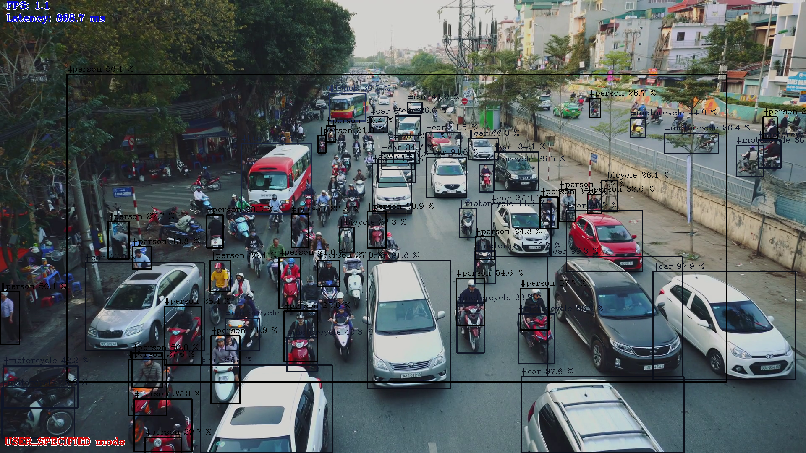
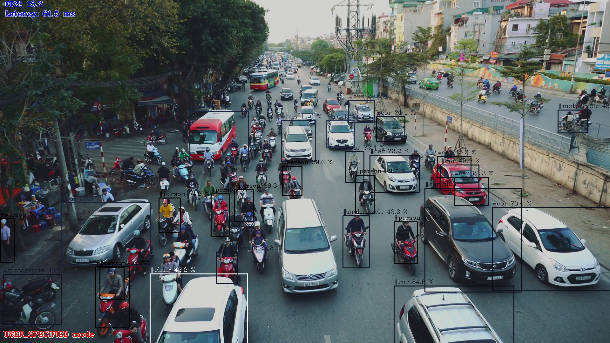
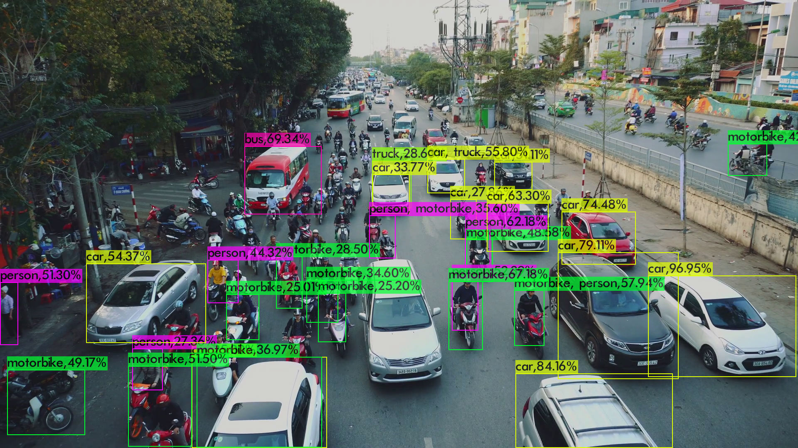

# OpenVINO-YOLOV4

## Introduction

 This is full implementation of [YOLOV4  series](https://github.com/AlexeyAB/darknet) in OpenVINO2021.3.

 Based on https://github.com/mystic123/tensorflow-yolo-v3

**Supported model**

- YOLOv4
- YOLOv4-relu
- YOLOv4-tiny
- [YOLOv4-tiny-3l](https://github.com/TNTWEN/OpenVINO-YOLOV4/tree/v4-tiny-3l)
- [YOLOv4-csp](https://github.com/TNTWEN/OpenVINO-YOLOV4/tree/ScaledYOLOv4)
- [YOLOv4x-mish](https://github.com/TNTWEN/OpenVINO-YOLOV4/tree/ScaledYOLOv4)

**Supported device**

- Intel CPU
- Intel GPU
- HDDL VPU
- NCS2
- ...   ...

**Supported model precision**

- FP32 
- FP16
- [INT8 Quantization](https://github.com/TNTWEN/OpenVINO-YOLOV4#int8-quantization)

**Supported inference demo**

- Python demo:all models
- C++    demo:YOLOv4,YOLOv4-relu,YOLOv4-tiny,YOLOv4-tiny-3l

## Development log
- Pruned-OpenVINO-YOLO：https://github.com/TNTWEN/Pruned-OpenVINO-YOLO

  A tutorial on pruning the YOLOv3/v4/v4-tiny/v4-tiny-3l model(**find the most compact model structure for the current detection task,greatly compress your model and improve detection FPS**)and deploying it in OpenVINO which can even meet the simultaneous inference of multiple video streams. Both Chinese and English versions are available. Welcome to have a try!

- YOLOv4-tiny-3l:https://github.com/TNTWEN/OpenVINO-YOLOV4/tree/v4-tiny-3l 

- OpenVINO 2021.3 AND OpenVINO2020.4 fully support the project！

- YOLOv4-csp and YOLOv4x-mish :https://github.com/TNTWEN/OpenVINO-YOLOV4/tree/ScaledYOLOv4

- Add INT8 Quantization support. Pruned-YOLOv4 series model+ INT8 Quantization  will be very friendly to embedded devices

## FAQ 
[FAQ](https://github.com/TNTWEN/OpenVINO-YOLOV4/issues/10)

## Environment

- OpenVINO2021.3 :https://docs.openvinotoolkit.org/latest/index.html or OpenVINO2020.4
- If you want to use yolov4+GPU+FP16,please don't use OpenVINO 2021.1 and OpenVINO2021.2
- Win or Ubuntu
- Python 3.6.5
- Tensorflow 1.15.5 （1.12.0 for OpenVINO2020.4 )
- YOLOV4:https://github.com/AlexeyAB/darknet   train your own model
- *Convert YOLOV3/2/1 model :https://docs.openvinotoolkit.org/latest/openvino_docs_MO_DG_prepare_model_convert_model_tf_specific_Convert_YOLO_From_Tensorflow.html


## How to use
★ This repository provides python inference demo for different OpenVINO version.[pythondemo](https://github.com/TNTWEN/OpenVINO-YOLOV4/tree/master/pythondemo)

★ Choose the right demo before you run object_detection_demo_yolov3_async.py

★ You could also use C++ inference demo provided by OpenVINO.

  (OpenVINO2021.3 default C++ demo path：`C:\Program Files (x86)\Intel\openvino_2021.3.394\deployment_tools\open_model_zoo\demos\multi_channel_object_detection_demo_yolov3\cpp`)

### YOLOV4

download yolov4.weights .  

```
#windows  default OpenVINO path

python convert_weights_pb.py --class_names cfg/coco.names --weights_file yolov4.weights --data_format NHWC

"C:\Program Files (x86)\Intel\openvino_2021\bin\setupvars.bat"

python "C:\Program Files (x86)\Intel\openvino_2021.3.394\deployment_tools\model_optimizer\mo.py" --input_model frozen_darknet_yolov4_model.pb --transformations_config yolov4.json --batch 1 --reverse_input_channels

python object_detection_demo_yolov3_async.py -i cam -m frozen_darknet_yolov4_model.xml  -d CPU


```


 

Compared with darknet:
 

### YOLOV4-relu

prepare yolov4.weights .  

```
#windows  default OpenVINO path
cd yolov4-relu

python convert_weights_pb.py --class_names cfg/coco.names --weights_file yolov4.weights --data_format NHWC

"C:\Program Files (x86)\Intel\openvino_2021\bin\setupvars.bat"

python "C:\Program Files (x86)\Intel\openvino_2021.3.394\deployment_tools\model_optimizer\mo.py" --input_model frozen_darknet_yolov4_model.pb --transformations_config yolov4.json --batch 1 --reverse_input_channels

python object_detection_demo_yolov3_async.py -i cam -m frozen_darknet_yolov4_model.xml  -d CPU
```


### YOLOV4-tiny

download yolov4-tiny.weights .  

```
#windows  default OpenVINO path

python convert_weights_pb.py --class_names cfg/coco.names --weights_file yolov4-tiny.weights --data_format NHWC --tiny

"C:\Program Files (x86)\Intel\openvino_2021\bin\setupvars.bat"

python "C:\Program Files (x86)\Intel\openvino_2021.3.394\deployment_tools\model_optimizer\mo.py" --input_model frozen_darknet_yolov4_model.pb --transformations_config yolo_v4_tiny.json --batch 1 --reverse_input_channels

python object_detection_demo_yolov3_async.py -i cam -m frozen_darknet_yolov4_model.xml  -d CPU
```

 

Compared with darknet:
 


## INT8 Quantization 

Thanks for [Jacky](https://github.com/jayer95)'s excellent work!

Ref:https://docs.openvinotoolkit.org/latest/pot_README.html

Environment:

- OpenVINO2021.3
- Ubuntu 18.04/20.04  ★
- Intel CPU/GPU

**Step 1：Dataset Conversion**

we should convert YOLO dataset to OpenVINO supported formats first.


|--annotations

​	|-- output.json    #output of convert.py , COCO-JSON format

|--images

​	|--  *.jpg      #put all the images here

|--labels

​	|--*.txt        #put all the YOLO format .txt labels here

|--classes.txt  

we use coco128 for example:

```
cd INT8
python3 convert.py --root_dir coco128 --save_path output.json
```

**Step 2: Install Accuracy-checker and POT**

```
sudo apt-get install python3 python3-dev python3-setuptools python3-pip

cd /opt/intel/openvino_2021.3.394/deployment_tools/open_model_zoo/tools/accuracy_checker 
sudo python3 setup.py install


cd /opt/intel/openvino_2021.3.394/deployment_tools/tools/post_training_optimization_toolkit
sudo python3 setup.py install
```

 **Step 3: INT8 Quantization using POT**

​	Prepare your yolo IR model(FP32/FP16) first.

```
source '/opt/intel/openvino_2021.3.394/bin/setupvars.sh'

pot -c yolov4_416x416_qtz.json --output-dir backup -e
```

​	Parameters you need to set in yolov4_416x416_qtz.json:

- Line 4,5 :Set FP32/FP16 YOLO IR model 's path

  ```
  "model":"models/yolov4/FP16/frozen_darknet_yolov4_model.xml",
  "weights":"models/yolov4/FP16/frozen_darknet_yolov4_model.bin"
  ```

- Line 29,30 :Set image width and height

  ```
  "dst_width": 416,
  "dst_height": 416
  ```

- Line 38: Annotation_file(COCO JSON file)

  ```
  "annotation_file": "./coco128/annotations/output.json"
  ```

- Line 40: Path of images

  ```
  "data_source": "./coco128/images",
  ```

- There are many other quantization strategies to choose from, and the relevant parameters are annotated in yolov4_416x416_qtz.json.Select the strategy you want to replace the default strategy and try by yourself!

**Step 4: Test IR model's map using Accuracy-checker** 

```
#source '/opt/intel/openvino_2021.3.394/bin/setupvars.sh'
accuracy_check -c yolov4_416x416_coco.yml -td CPU #-td GPU will be faster
```

​	Parameters you need to set in yolov4_416x416_qtz.json:

- Line 5,6 ： Set IR model 's path

  ```
  model: models/yolov4/FP16/frozen_darknet_yolov4_model.xml
  weights: models/yolov4/FP16/frozen_darknet_yolov4_model.bin
  ```

- Line 12: number of classes

  ```
  classes: 80
  ```

- Line 25: Image size

  ```
  size: 416
  ```

- Line 38:Annotation_file(COCO JSON file)

  ```
  annotation_file: ./coco128/annotations/output.json
  ```

- Line 39: Path of images

  ```
  data_source: ./coco128/images
  ```
