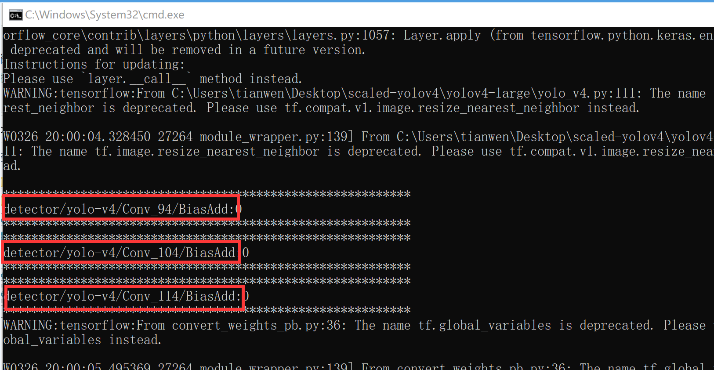
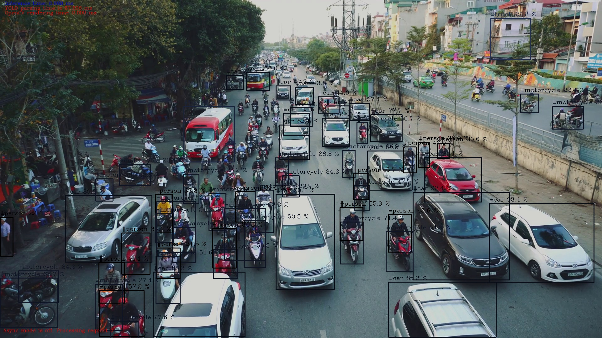
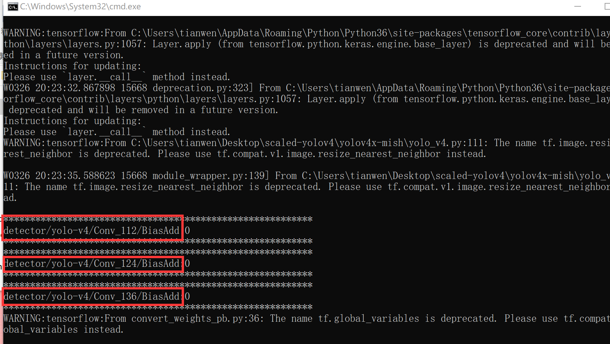

# YOLOv4-csp

OpenVINO 2021.3

Tensorflow 1.15.5

Win/Ubuntu

Only python inference demo now

```
python convert_weights_pb.py --class_names cfg/coco.names --weights_file yolov4-csp.weights --data_format NHWC

"C:\Program Files (x86)\Intel\openvino_2021\bin\setupvars.bat"

python "C:\Program Files (x86)\Intel\openvino_2021.3.394\deployment_tools\model_optimizer\mo.py" --input_model frozen_darknet_yolov4_model.pb --batch 1 --reverse_input_channels --output detector/yolo-v4/Conv_94/BiasAdd,detector/yolo-v4/Conv_104/BiasAdd,detector/yolo-v4/Conv_114/BiasAdd

python ../yolov4-inference-demo.py -i test-pic1.png -d CPU -m frozen_darknet_yolov4_model.xml -at yolov4 -t 0.2 --labels cfg/coco.names
```


prepare for future model pruning:

- parse_config.py ：Generate tensorflow model conversion code automatically according to darknet .cfg file 
- namespace: Output of convert_weights_pb.py which is used for mo.py's `--output`



# YOLOv4x-mish

OpenVINO 2021.3

Tensorflow 1.15.5

Win/Ubuntu

Only python inference demo now

```
python convert_weights_pb.py --class_names cfg/coco.names --weights_file yolov4x-mish.weights --data_format NHWC

"C:\Program Files (x86)\Intel\openvino_2021\bin\setupvars.bat"

python "C:\Program Files (x86)\Intel\openvino_2021.3.394\deployment_tools\model_optimizer\mo.py" --input_model frozen_darknet_yolov4_model.pb --batch 1 --reverse_input_channels --output detector/yolo-v4/Conv_112/BiasAdd,detector/yolo-v4/Conv_124/BiasAdd,detector/yolo-v4/Conv_136/BiasAdd

python ../yolov4-inference-demo.py -i test-pic1.png -d CPU -m frozen_darknet_yolov4_model.xml -at yolov4 -t 0.2 --labels cfg/coco.names
```





prepare for future model pruning:

- parse_config.py : Generate tensorflow model conversion code automatically according to darknet .cfg file 

- namespace: Output of convert_weights_pb.py which is used for mo.py's `--output`

  
  
  

## Reference

https://github.com/AlexeyAB/darknet

https://github.com/WongKinYiu/ScaledYOLOv4/tree/main

https://github.com/Chen-MingChang/pytorch_YOLO_OpenVINO_demo
